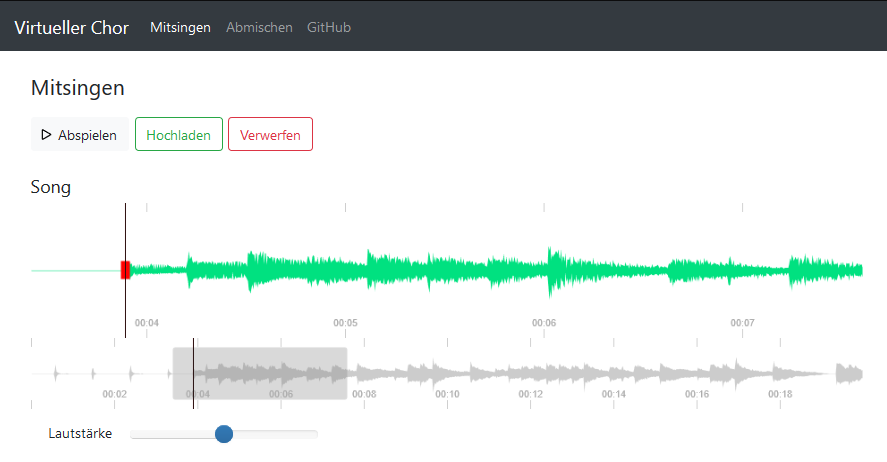

## Virtual Choir

Coordinates voice recordings and synchronized mixes in virtual choirs.

### AWS setup instructions

This will set up a virtual choir on AWS EC2 with a Let's Encrypt certificate.
A custom domain is required because `MediaDevices.getUserMedia()` only works with HTTPS.

- `git clone https://github.com/ekuiter/virtual-choir.git && cd virtual-choir`
- Update `js/app.js` with the songs you want to sing.
- For each song, supply a PDF and MP3 file in the `songs` directory (e.g., generated by [MuseScore](https://musescore.org) or [bemuse](https://github.com/ekuiter/bemuse)).
- Generate a `.htpasswd` file with some login credentials.
- Create an [AWS](https://aws.amazon.com) account and a user with AdministratorAccess in the [IAM console](https://console.aws.amazon.com/iam/home#/users).
- Install [EB CLI](https://github.com/aws/aws-elastic-beanstalk-cli-setup).
- `eb init --platform "PHP 7.3 running on 64bit Amazon Linux" --region "eu-central-1"`
- `eb create virtual-choir --single --database --database.engine "mysql" --database.username "<username>" --database.password "<password>" --envvars "CERT_DOMAIN=<custom-domain>"`
- Take note of the `CNAME` field in `eb status`.
- `eb ssh -c "wget https://dl.eff.org/certbot-auto; chmod a+x certbot-auto; sudo ./certbot-auto certonly --debug --manual --preferred-challenges dns --email <your-email-address> --domains <custom-domain>"`
- You may need to press `y` and `Enter` after installing dependencies. Then agree to the terms and IP logging.
- Take note of the `TXT` field, create according `CNAME` and `TXT` DNS records for your custom domain, and press `Enter`.
- `eb deploy`